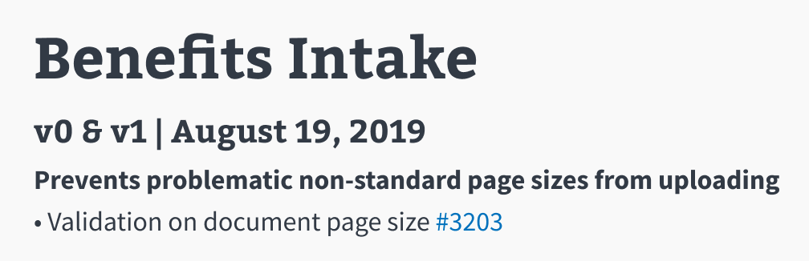

# Release Notes Instructions.

#### Release notes should match the following format:

## MD FORMAT SAMPLE
`# Name of API`

`## API versionname(s) | Month 00, Year`

`### Bolded 
 level plain english description of benefit of the change`

`### • brief details on changes made with link to Github Issue  [#1111](https://github.com)`

## HTML TEXT SAMPLE
`# <h1>` Benefits Intake

`## <h2>` v0 & v1 | August 19, 2019

`### <bold>
` **Prevents problematic non-standard sizes from being uploaded**

`### 
` • Validation on document page size [#3212](https://github.com/department-of-veterans-affairs/vets-api/pull/3213)

## IMAGE SAMPLE

